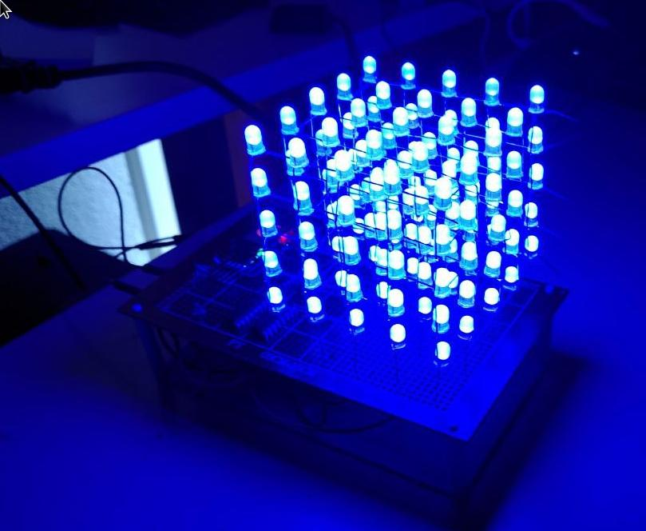

# ledcube.rs

Controller for LED Cubes using pure Rust. It runs on the awesome [Sipeed Longan Nano](https://github.com/SeeedDocument/Sipeed-Longan-Nano/tree/master/res) RISC-V dev board (ordered it on seeedstudio). While RISC-V seems to gain traction lately it can unfortunately not yet be used for my daily workloads. But it fascinates me to combine this very new CPU with oldschool analog technology. I also choose it because Rust support is very good.

# OneStop build'n'flash
Hold down `BOOT0` and shortly press `RESET`. Then:
```
cargo build --release && riscv32-elf-objcopy -O binary target/riscv32imac-unknown-none-elf/release/ledcubers firmware.bin && sudo dfu-util -a 0 -s 0x08000000:leave -D firmware.bin
```

# Endproduct

Small demo of the first 5x5x5 cube I made:


And a picture of the second one:



# Schema

Electrical and PCB schemas can be foud in [this repository](https://github.com/xermicus/pcb/tree/main/ledcube_5).

# LICENSE
This project is licensed under the [Mozilla Public License](LICENSE)
